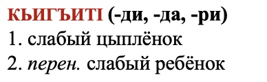
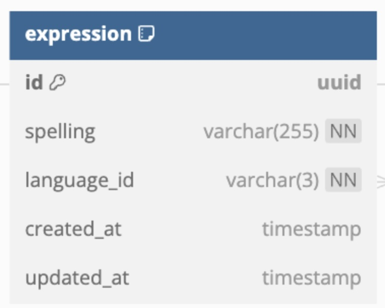
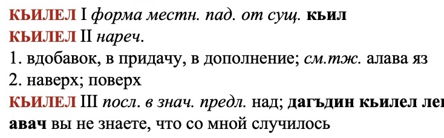
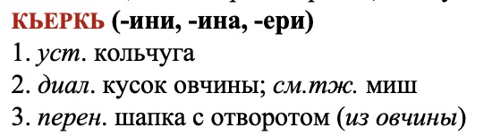
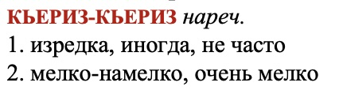

# Dictionary Structure

Fist of all, let's define the most important terms that we are using in our dictionary data structure:

## Expression

A word or a phrase in a language. It can be a single word, a phrase, or a sentence, but currently it is mostly a single word and rarely a short phrase.

### Example

In the image below the word in red **"КЬИГЪИТI"** is an expression.



### JSON representation

In JSON the expression is represented as an object which encapsulates the expression spelling and its details:

```js
{
  "expression": {
    "spelling": "КЬИГЪИТI",
    "details": [ /* Expression details go here ... */ ]
  }
}
```

### Database table



## Inflection

[Inflection](https://dictionary.cambridge.org/dictionary/english/inflection) is the way word changes its form based on the context where it is used. From example above an inflection of the word **"КЬИГЪИТI"** is **(-ди, -да, -ри)**

## Expression details

Some expressions have multiple definitions that are varying too much from each other. In this case the authors write it down multiple times (mostly annotated with Roman numerals). We are bundling this kind of translations together and we call each of those transations **expression details**.

Expression details is build up from:
1. **Definition details** list
2. **Examples** list

Both of those lists are optional and can be empty, but it rarely happens for both of them at the same time.

### Example

Below we see expression **"КЬИЛЕЛ"** which not only has 3 different translations, but all of them also differ as part of speech:
- `КЬИЛЕЛ I` - (_сущ._) **noun**
- `КЬИЛЕЛ II` - (_нареч._) **adverb**
- `КЬИЛЕЛ III` - (_посл._) **afterword**



This is an example of expression **"КЬИЛЕЛ"** with 3 expression details

## Definition details

In the same way as expression details, definition details are a list of definitions that are varying from each other, but the difference is not as big as in expression details.

Definition details is build up from:
1. **Definitions** list
2. **Examples** list

### Example

For example here the expression **"КЬЕРКЬ"** has 3 translations, but they are all nouns and all of them are related:

1. old term
2. dialect
3. figurative meaning



## Definitions

Definition is the actual translation (or meaning in case of explanatory dictionary) of the expression. There can be multiple definitions within a single **definition detail** but they are all closely related to each other, one could even say they are all synonyms.

### Example

Here for the _adverb_ **"КЬЕРИЗ-КЬЕРИЗ"** we see that each line (_definition detail_) contains multiple comma separated definitions and they all mean the same thing:

1. occasionally, sometimes, not often
2. finely, very fine

Here are "occasionally, sometimes, not often" a list of definitions and each of them is a **definition**.

