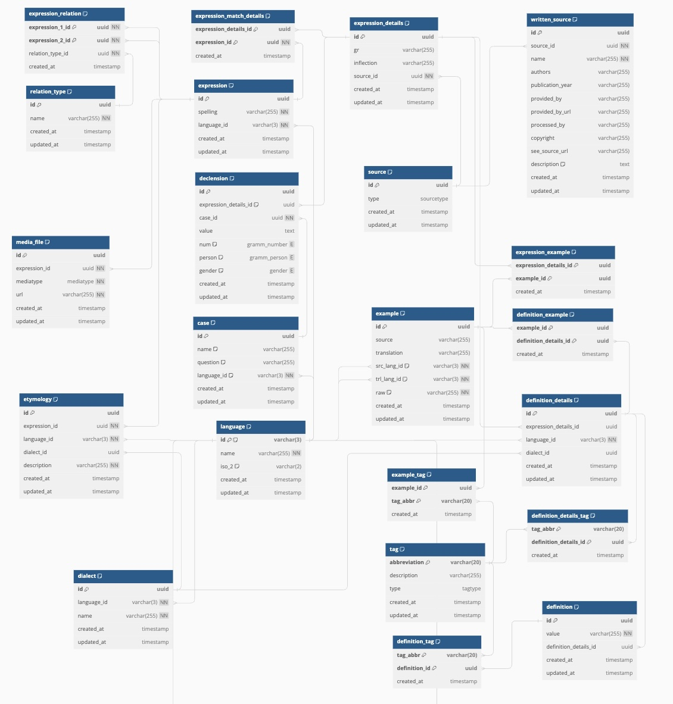

# Database overview

Below is a diagram of the database structure of Gafargan data as of February 2024. The diagram is generated using [dbdiagram.io](https://dbdiagram.io/d/GafalagGafargan-V2-64b2ec0f02bd1c4a5e21b6a0). The diagram is a work in progress and will be updated as the database structure changes. Further we will provide a detailed explanation of the database structure step by step.

## Update an existing version

It is possible to edit versioned docs in their respective folder:

- `versioned_docs/version-1.0/hello.md` updates `http://localhost:3000/docs/hello`
- `docs/hello.md` updates `http://localhost:3000/docs/next/hello`
